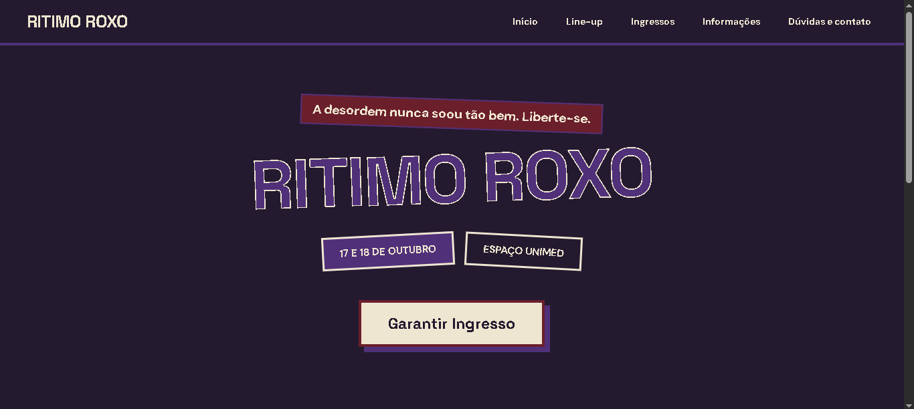
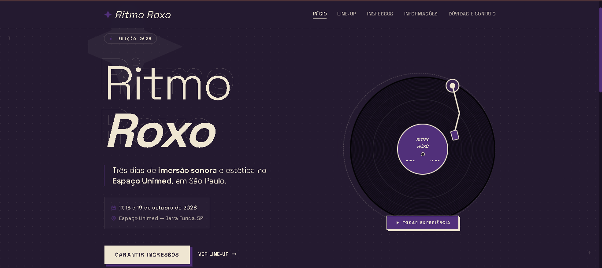

# Nome do festival: Ritmo roxo
**Dupla:** Lilith Sophia Ferreira Oliveira e Sarah Dandara Lima Macedo
**Site Publicado:** https://ritmo-roxo.vercel.app/

## Briefing
Publico: Jovens (14 a 30 anos), com gosto musical em foco pop alternativo, que esperam uma estetica visual forte; experiencia emersiva; conexão emocional e ambiente inclusivo 

Clima: Imersivo, emocional e estetico

Paletas: 
violeta muito escuro (quase preto) #241A30: É a cor de fundo principal utilizada no corpo da página e em vários blocos.
roxo #51307A: É o tom de roxo intermediário (destaque) usado em botões, sombras sólidas, bordas e detalhes gráficos.
creme #EFE6D2: É a cor clara principal (creme/marfim) usada para textos, títulos, bordas e ícones, contrastando com o fundo escuro.
#111111 / #0D0B12: Utilizados nos detalhes internos do disco de vinil e ranhuras.
#C5BCAB: Uma versão translúcida da cor creme, usada para textos secundários e descrições com menor destaque.
#4A433D: Um tom creme altamente translúcido, usado para linhas divisórias sutis, bordas delicadas e elementos decorativos de fundo.

Fontes: Space Grotesk (Titulos): foi escolhida por conferir um visual moderno, geométrico e arrojado aos títulos, reforçando a identidade conceitual e alternativa do festival.
DM Sans (Textos): foi selecionada por garantir uma leitura limpa, confortável e fluida nos blocos de texto e descrições da interface.

Sites de inspirações:
https://valkyuri.com/ - Estética visual ousada, underground e de alto contraste.
https://www.ticketmaster.com.br/ - Estrutura de bilheteria e cards no formato de ingressos picotados.
https://pt.stardewvalleywiki.com/Stardew_Valley_Wiki - Organização clara de dados e blocos informativos detalhados.

## Antes e depois

## Os 4 prompts que mais fizeram diferença
1. Estou fazendo o site de um festival de pop chamado Ritmo Roxo, para um público jovem que gosta de ambientes caotico. Use estas cores: fundo #241A30, roxo #51307A, creme #EFE6D2 e vinho #6B1F2A. A fonte dos títulos é Space Grotesk e a dos textos é DM Sans. Escreva o arquivo index.html completo com o nome do festival, datas (17-18 de outubro), local (espaço unimed), uma frase de chamada e o destaque de 3 atrações principais (billie eilish, melanie martinez, rita lee), com o header tendo o nome do festival à esquerda e o menu à direita (Início, Line-up, Ingressos, Informações, Dúvidas e contato), usando display flex, e tenha um footer. O CSS vai ficar no arquivo style.css. Não use gradientes nem emojis.

2. Briefing:
Publico: Jovens (14 a 30 anos), com gosto musical em foco pop alternativo, que esperam uma estetica visual forte; experiencia emersiva; conexão emocional e ambiente inclusivo 

Clima: Imersivo, emocional e estetico

Paletas: violeta muito escuro (quase preto) #241A30, roxo #51307A, creme #EFE6D2 e preto #000000
Fontes: Space Grotesk (Titulos), DM Sans (Textos) 
Estou fazendo o site de um festival de pop chamado Ritmo Roxo, com cinco paginas; Início, Line-up, Ingressos, Informações, Dúvidas e contato, para um público jovem que gosta de musica pop alternativa. Use estas cores: fundo #241A30, roxo #51307A, creme #EFE6D2 e preto #000000. A fonte dos títulos é Space Grotesk e a dos textos é DM Sans. Escreva o arquivo index.html completo com o nome do festival, datas (17-18 de outubro), local (espaço unimed), uma frase de chamada e o destaque de 3 atrações principais (billie eilish, melanie martinez, rita lee), com o header tendo o nome do festival à esquerda e o menu à direita (Início, Line-up, Ingressos, Informações, Dúvidas e contato), usando display flex, e tenha um footer. O CSS vai ficar no arquivo style.css. Não use gradientes nem emojis. faça um site inspirado nesse

3. separe esse codigo em index.hmtl, lineup.html, ingressos.html, informacoes.html e faq.html o css deles fica no style.css

4. deixe o index.html mais bonito e decorado sem mudar as cores e nem colocar gradiantes